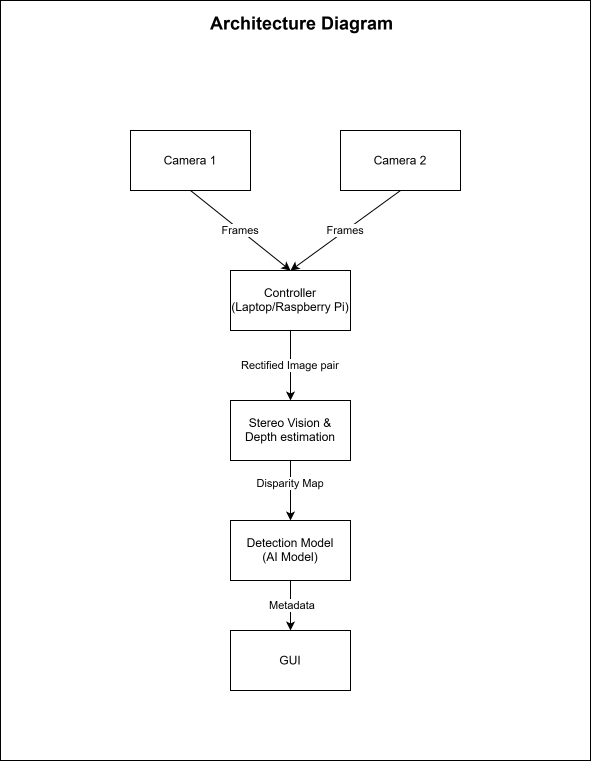

## Architecture Diagram

## Class Diagram

## Getting 2D Point from Stereo Camera
![UML](https://img.plantuml.biz/plantuml/svg/VLRDRjj64BuJq3iCb8DjWB8g5oXQWIKIIvKJLAu5nGLYmq2n8eVI9kGkiLpLP0jVYvvpwGFrJV8adTtbdrGX52HoTsQ--UPdXtfTQARqFaiXPz4djiKvPrl5ie6dkKuHRb1hBhPmDOULv493ecG6xpKgb31Z6Ie600FlBCL4WvQW-7Qd8UOA8ysb67ZcKtpY8cS42_S6TI65VgyhWj_8DEwBKovGLpc2L7edJnloFn0ctvFB8-4r1R1LSY_YcKobWbTBG-KwtUCXXJfGHy3GP6ARuWcDpjlaXFIqkrd5RCndSCkuW4XckHGeT37mQZiO7cPlndAzLpW4LZJF40HlcOgVcS8mh85l5AA0FmVUYqjfWxOsUKvun4osZHpiPVLQZpEMyeroAdEcMUsismo2cHG9t-xTchpMIBM_Daqj-vMI4HQ5wOqLpz4Kpg8s2mlf-3_lk4O3w21RLdURZmGBSzIkL-3yuMvvDvc82ulKxGV1ctTmAsDCmz3nSaWl3SS3sCxkbkbeHmoVn7b1jIiGY9B2WaeIeuZG-McqkkJry8-nkG7YkYAaBDzhcot7jfKOcA_po_KEVYeqpwmviRjNdBAxJ-swYPwqg4JHILedOB-TKo_aIdvqmLkG_iPNS5xw3JMyPRcfRX-7jipEKLFqBMerBjxaETNhvjTtflABnUox7-REh3Owimq8IIgVwNG8uRmKHg3s0gH8A_g9418wKvXGPtCgLJNmchCn6eM7JJ-5uT9Vqs2YyrGC1zxXYHWP_RObI5SvCSQrnPC0CXyQRbtdMAkcCSW8ubPa1XsLh5pwKD5tiv7bXRK-IqemDBjJTNaPzkeuXM0J9lvrCDw49nIFO_hPd_jh__v9h2V--ifVJVpLrT1wyPFgb7clrDOL97vK-b5L-njuRQExdBGDIyuo8wAKsEbTHrUkNLoTOftBEY0oYnlHaoYNexB9OXEnAzK1hs5ik__HQXx8wfIxHYF5ym_-W__eA3JRJiKrcL79MFvRwOEvLKxJVPQuHL57urgsRRfftVn1PARszDKtT2qMuSBsGZk0l_pr-MYocft_3IopsMRLBBfSsPMDrJpHuNIwkRtJyGZ6ba3es53m8_Uqa2gZGL0qFEbgipo567w4SWbV_lvCvMaLh9yfF9BmF85__u7h2nX3tChxUPwskn-CUWaZYCeBO_H8DaahVJ3IoaYhJWh7RCVZNwJ6ATplU06_eofCLkZncUXgUb_5UsLIGpCNcOfsFkWTdMmkM0eyorFCwDNeyXinqkP9WehU_I2aXWq2bYpID12CLK45kXoF1vwfh2kmAVLhkjFVb_y0)

## References
# Stereo vision
1. Revised_Thesis_RvG_v021.pdf (Tidalis)
2. Stereo Vision and depth estimation: https://www.geeksforgeeks.org/computer-vision/stereo-vision-and-depth-estimation/
3. Camera Calibration and 3D Reconstruction: https://docs.opencv.org/4.x/d9/d0c/group__calib3d.html
4. stereo vision: https://visionbook.mit.edu/3d_scene_understanding_stereo.html

## Important Notes
The Architecture and the Class Diagrams underwent core changes because the previous versions were over detailed, making them difficult to maintain as the Project requirements and the codebase evolved. The current versions above are minimal and adapt easily for changes.